### ANÁLISE DE SENTIMENTOS AMERICANAS
Este projeto utiliza técnicas de Processamento de Linguagem Natural (PLN) para classificar o sentimento dos comentários feitos pelos usuários na review de produtos do site Americanas.com. A documentação completa deste projeto pode ser acessada no arquivo “documentação_americanas.pdf”.

#### DATASET
A base de dados utilizada foi disponibilizada pela B2W e contém colunas referentes ao título e texto da avaliação, nome e categoria do produto vendido, data de nascimento, gênero e localização do usuário que comprou o produto. Além disso, esta base contém as colunas “overall_rating” e “recommend_to_a_friend” que são referentes ao sentimento do usuário com relação ao produto comprado. 

A coluna “overall_rating” pode possuir 5 valores, estando na escala de 1 a 5, onde o valor mais alto corresponde a um alto nível de satisfação com o produto. A coluna “recommend_to_a_friend” pode ter respostas assinaladas com “Yes” ou “No” e corresponde as respostas do usuário quando eles foram perguntados se eles indicariam o produto comprado para um amigo. Conforme as informações publicadas pelo artigo do B2W, existem inconsistências que podem ocorrer ao analisar os sentimentos dos usuários com base na coluna “overall_rating”. Sendo assim, este projeto utiliza a coluna “recommend_to_a_friend” para classificar o sentimento dos comentários feitos pelos usuários.

#### PRÉ-PROCESSAMENTO
As técnicas de remoção de caracteres especiais, remoção de StopWords, Lematização e Stemização foram utilizadas para o processamento textual das colunas “review_title” e “review_text”. O pré-processamento foi realizado utilizando o notebook “text_processing.ipynb” e a GPU do Google Colab, contendo apenas as primeiras 50 mil linhas do Dataset. 

#### EXPERIMENTOS
Visando encontrar os melhores parâmetros para o projeto, foram desenvolvidos uma série de experimentos utilizando vários tipos de pré-processamento textual, classificadores e técnicas para validação dos modelos. Os experimentos foram realizados utilizando o notebook “experimentos.ipynb” que foi executado utilizando a GPU do Google Colab. Além disso, os dados foram divididos em 80% para treinamento e 20% para teste dos classificadores. Os testes desenvolvidos foram:

- **Vetorização dos dados:** foram testados os algoritmos de vetorização Doc2Vec e o TF-IDF. Os dois algoritmos de vetorização foram utilizados em conjunto com o classificador de Regressão Logística.  O classificador treinado com o Doc2vec obteve 85.8% de acurácia, o treinado utilizando o TF-IDF obteve 90.19% de acurácia. Por tanto, para este problema, o melhor algoritmo de vetorização foi o TF-IDF utilizado em conjunto com o CountVectorizer. 

- **GridSearch:** Esta técnica foi implementada nos classificadores LogisticRegression, BernoulliNB, KNeighborsClassifier e RandomForestClassifier da biblioteca Scikitlearn. Ela é utilizada com o intuito de encontrar os parâmetros mais adequados para serem utilizados nos classificadores.
  
- **Validação cruzada:** Esta técnica foi utilizada para validar o melhor modelo de classificação. O algoritmo K-fold com K igual a 10 foi utilizado, sendo avaliadas as métricas de acurácia e f1-score. O classificador que obteve os melhores resultados foi o de Regressão logística com 90.32% de média de acurácia e 93.65% de média de F1-Score.  A Tabela abaixo exibe os resultados obtidos através destes experimentos.
  
  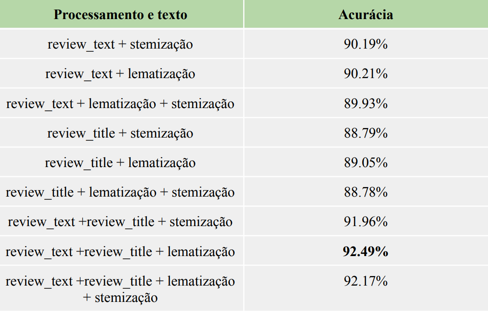
  
- **Processamento textual:** Utilizada para encontrar o melhor tipo de processamento textual, os algoritmos de Lematização e Stemização foram utilizados. Com isso, utilizando o TF-IDF e o classificador de Regressão Logística, foram realizados testes utilizando os tipos de pré-processamento e as colunas review_text e review_title do dataset. A Tabela abaixo exibe o resultado destes experimentos.
  
  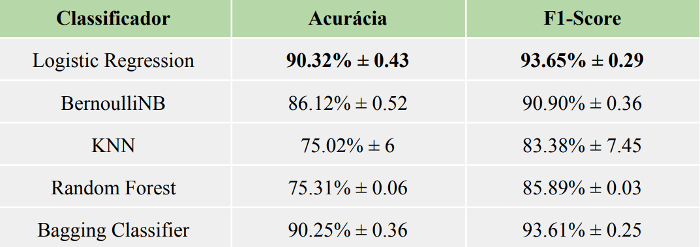

Com isso, a partir dos resultados obtidos nos experimentos, ficou comprovado que os melhores resultados foram obtidos utilizando os algoritmos de lematização, TF-IDF e o classificador de Regressão Logística. Este algoritmos em conjunto obtiveram 92.49% de acurácia nos testes. A figura abaixo exibe a matriz de confusão do modelo utilizado neste pipeline.

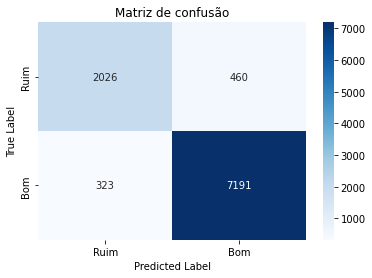

#### REPRODUTIVIDADE
A base de dados utilizada neste projeto está na pasta Dataset. Os modelos são salvos automaticamente dentro da pasta Models.  Além disso, para utilizar este projeto deve-se clonar este repositório e executar o seguinte comando dentro da pasta do projeto: 

```
pip install -r requirements.txt
```

Para treinar um novo modelo pode-se executar o comando abaixo:

```
python src/americanas/train.py
```

Caso seja necessário alterar o caminho da pasta do dataset ou o caminho em que os modelos serão salvos, pode-se enviar estes caminhos como argumento. Sendo eles:
```
--path_dataset <caminho_dataset> 
--path_count <caminho_count_vectorizer> 
--path_tfidf <caminho_tfidf>
--path_model <caminho_classificador>
```
Para realizar a predição de um texto, pode-se executar o comando abaixo:

```
python src/americanas/predict.py --text "este produto é muito bom"
```

#### STREAMLIT
Uma aplicação no Streamlit foi desenvolvida com o intuito de facilitar a análise do sentimento de um texto. A aplicação permite que o usuário visualize o dashboard das análises realizadas e também  insira um título e um texto de uma análise que a aplicação irá retornar para o usuário qual o sentimento do texto, podendo ser um sentimento positivo ou negativo. Este é o [link](https://stefaneadna-nlp-sentiment-analysis-neow-srcamericanasapp-rmkwy2.streamlit.app/) para acesso da aplicação.

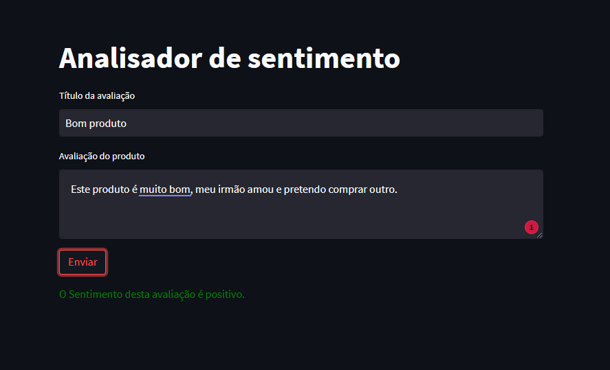

#### ANÁLISES

Foram realizadas algumas análises utilizando a base de dados da B2W. A figura abaixo exibe o gráfico da relação entre a quantidade de avaliações dos produtos, o gênero e o sentimento de avaliação dos usuários. A partir desta analise, pode-se perceber que a maior quantidade de avaliações possuem sentimento positivo e as pessoas do sexo masculino costumam fazer mais avaliações no site das Americanas.

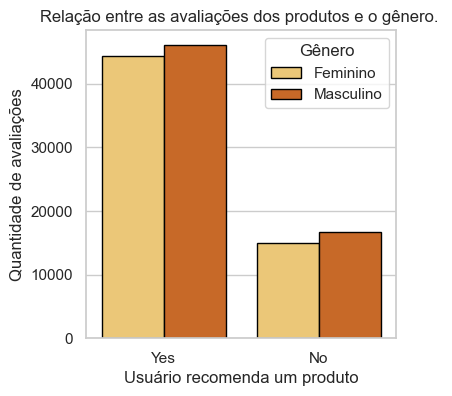

A figura abaixo exibe um gráfico que contém uma relação da idade dos usuários com quantidade de compras que eles fazem. Para esta avaliação, a idade dos usuários foram divididas em quatro grupos, sendo o primeiro grupo as pessoas entre 15 e 30 anos, o segundo as pessoas entre 30 e 45 anos, o terceiro as pessoas entre 45 e 60 anos e o último as pessoas entre 60 e 100 anos. A partir desta analise, fica claro que as pessoas mais jovens tendem a não fazerem muitas análises dos produtos que compram. Não é possível afirmar se elas são as que menos compram produtos, pois a base de dados não contém esta informação. Com isso, o grupo que mais realizou avaliações é o grupo entre 45 e 60 anos.

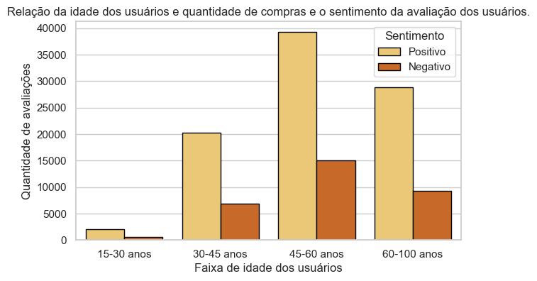

Outra análise realizada foi a dos produtos que possuem as maiores quantidades de avaliações positivas e negativas. Como pode ser visualizado nas figuras abaixo, alguns produtos possuem a indicação de valores de variação (traço na barra), isso ocorre para produtos que são iguais, mas possuem a cor diferente.

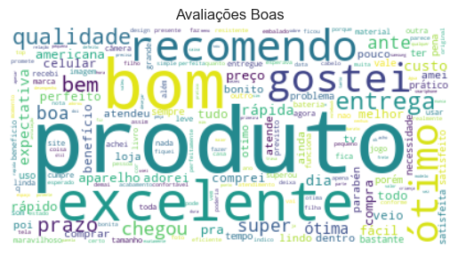
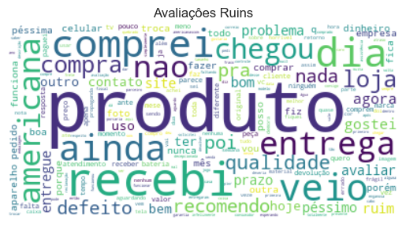

Ademais, também foi analisado o top dez de categorias de produtos mais avaliadas. Conforme fica claro na visualização da figura abaixo, as categorias de produtos de Smartfone, TV e Cabelo são as mais avaliadas.

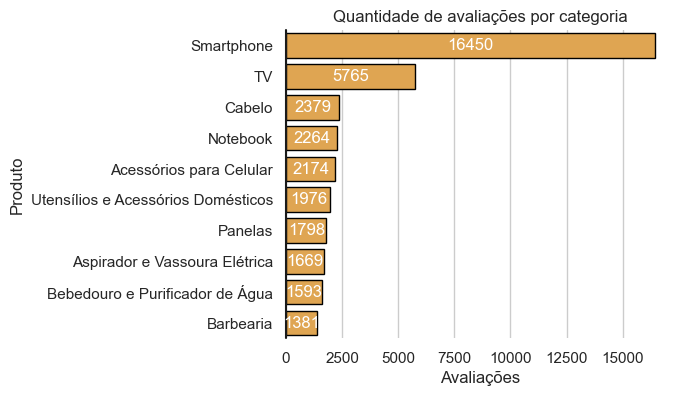

As nuvens de palavras para as avaliações boas e ruins também foram geradas. Conforme as figuras abaixo. Na nuvem de palavras de avaliações boas, pode-se visualizar palavras como: recomendo, bom, excelente, ótima, rápida, qualidade. Na nuvem de palavras de avaliações ruins pode-se visualizar palavras como: péssimo, ruim, defeito e problema.

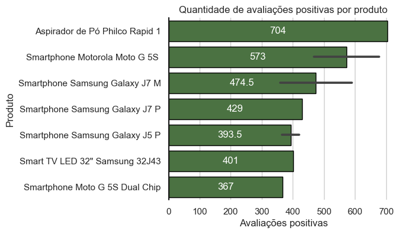
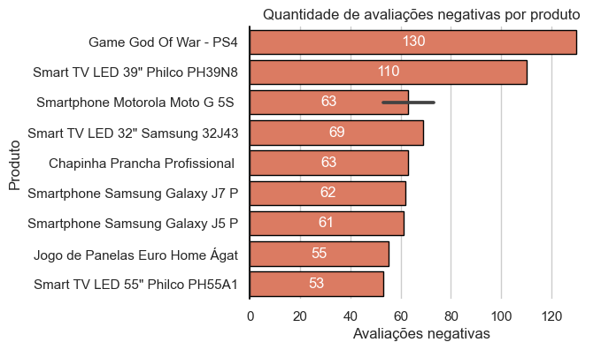